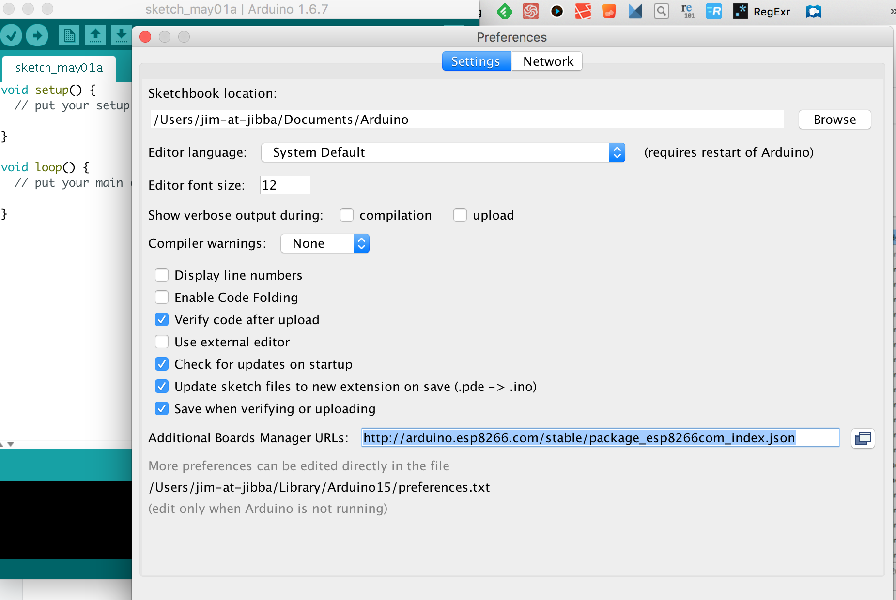
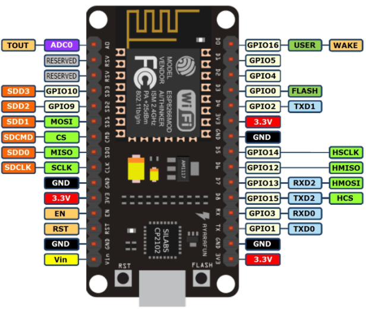

In this article, I will talk about the first steps needed to start building robots with Javascript. I will be using the infamous [ESP8266 microcontroller](https://en.wikipedia.org/wiki/ESP8266), this is because it is super cheap and allows it not to be tethered to your machine in the way that an Arduino would be.

To allow us to write our robotics scripts in Javascript with will be using the [Johnny-Five](http://johnny-five.io/) library written by Rick Waldron. The library supports a huge selection of boards and hardware. Although not all boards support all of the hardware.

Several other boards could be used as alternatives (Proton, Tessel) but these are considerable more expensive and not as easily available. It is also possible to use an Arduino attached to a Raspberry Pi (RPi) and you then interface wirelessly with the RPi but that seems a little unnecessary now.

There are better languages to build robots with, but being an engineer working primarily in Javascript, I was keen to keep things close to home. In this setup Javascript is not run on the microcontroller but is run through some custom firmware called the Firmata protocol. This does mean it runs slower than something like C would but generally for things like robots this is not much of an issue. The first step in this process is to upload the `StandardFirmataWifi` sketch onto our board but to be able to do that we need the Arduino IDE and for it to recognise our ESP8266 based boards.

## Getting set up

The following instructions are based on using a mac. They will be very similar to other platforms.

Copy the following URL `http://arduino.esp8266.com/stable/package_esp8266com_index.json`. Open the IDE and go to the files menu and click on preferences. Add the URL to the ‘Additional Boards Manager URL’.



Close the preferences panel and click tools. Under tools select boards and then board manager. Navigate to esp8266 by esp8266 community and install the software for Arduino.


Once this has been done you should be able to program your ESP8266 based board, I am using the NodeMCU board.

Click the examples panel and select the Wireless Firamta sketch. We will be updating so make a copy now.

We need to update the header file `wifiConfig.h` with our network credentials. Update the values of `char ssid[] =""` and `char wpa_passphrase[] =""`.

With this done we can now upload the sketch to our device. Once uploaded you can close the Arduino IDE.

Don’t forget that the ESP\* boards have a different pin layout to the Arduino boards. See the picture below for an example.



Now that we are all set up on the microcontroller we need to create a new node project and install the needed packages.

## Our first robot script

Create a new folder for the project and initialise a new node project

`mkdir helloWorld && cd $_ && npm init -y`

Now we need to install Johnny-Five and the ethernet client that allows us to connect wirelessly.

`npm install johnny-five ethernet-client keypress`

With this done we are set to write our first script.

```javascript
const { EtherPortClient } = require("etherport-client")
const { Board, Led, Pin } = require("johnny-five")
const keypress = require("keypress")

const board = new Board({
  port: new EtherPortClient({
    host: "192.168.1.109",
    port: 3030,
  }),
  repl: false,
})

keypress(process.stdin)
const LED_PIN = 2

board.on("ready", () => {
  console.log("Board ready")
  var led = new Led(LED_PIN)
  console.log("Use Up and Down arrows for On and Off. Space to stop.")

  process.stdin.resume()
  process.stdin.setEncoding("utf8")
  process.stdin.setRawMode(true)

  process.stdin.on("keypress", (ch, key) => {
    if (!key) {
      return
    }

    if (key.name === "q") {
      console.log("Quitting")
      process.exit()
    } else if (key.name === "up") {
      console.log("Blink")
      led.blink()
    } else if (key.name === "down") {
      console.log("Stop blinking")
      led.stop()
    }
  })
})
```

We need to replace `10.0.0.49` with the IP assigned to our board. I use an app called Fing but this information can be found out from the Serial monitor in the Arduino IDE.


This simple script will make the allow you to turn the onboard led on and off. Nothing fancy but paves the way for much more exciting things. To execute the file `node index.js`. You should see something similar to this:

```bash
$ node hello.js
1590554783332 SerialPort Connecting to host:port: 192.168.1.109:3030
1590554783334 Connected Connecting to host:port: 192.168.1.109:3030
1590554793338 Use Up and Down arrows for On and Off. Space to stop.
```

[[youtube: IK3UvvmUzsc]]

Now that the board is set up we are ready to create some more interesting projects. Johnny Five provides such a gentle introduction to robotics in Javascript but allows you to do so much as you have the wealth of packages in NPM and hundreds of public APIs that you can lean on to create great projects.

The next article will be a nice short one, introducing the Johnny Five repl and why it is great for prototyping your next project.

# Thanks for reading 🙏

If there is anything I have missed, or if there is a better way to do something then please let me know.

Check out our software focused podcast - [Salted Bytes](https://open.spotify.com/show/7IdlgpiDfYcOdCn57mPLvH?si=X1ArfHvqQXSOAfc1h7Y_Eg)
